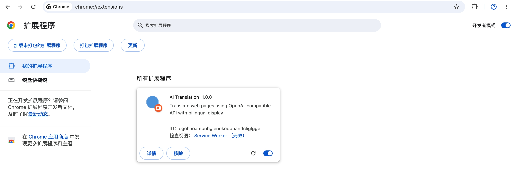
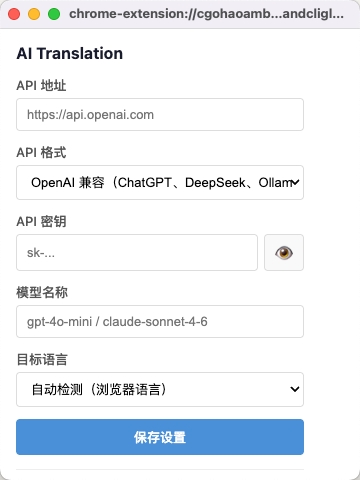
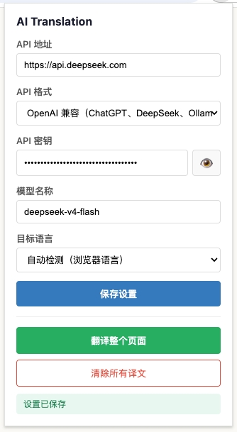
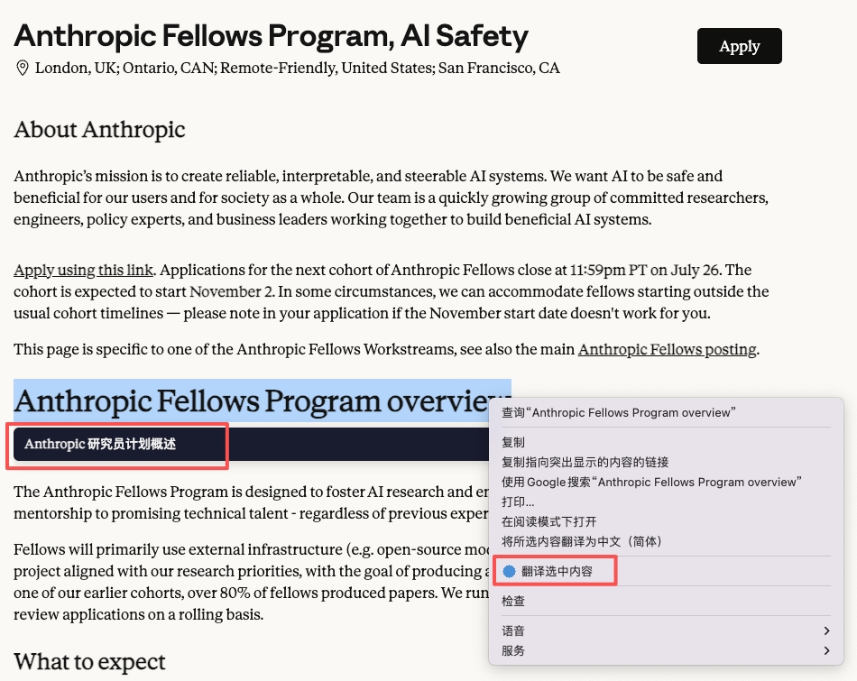
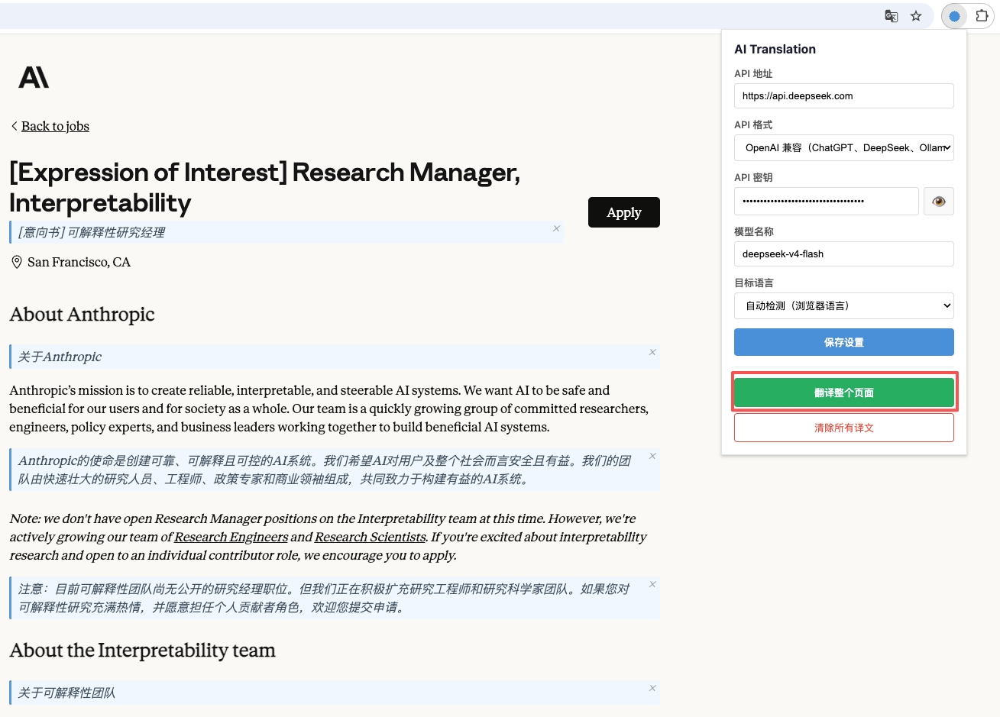

# AI Translation - 浏览器网页翻译插件

用你自己的 AI 账号翻译网页内容，支持 OpenAI 兼容接口和 Anthropic Claude，双语对照显示。

## 功能

- **选中翻译** — 选中文本右键「翻译选中内容」，译文显示在原文下方
- **整页翻译** — 一键翻译页面所有段落，双语对照阅读
- **多接口支持** — OpenAI、DeepSeek、Ollama、Anthropic Claude 及任何兼容接口
- **加密存储** — API 密钥使用 AES-GCM 256 位加密，不存明文
- **译文可控** — 单条关闭或一键清除所有译文
- **自动识别语言** — 检测网页语言和浏览器本地语言

## 安装

1. 下载或克隆本项目
2. 打开 Chrome，进入 `chrome://extensions`
3. 开启右上角「开发者模式」
4. 点击「加载已解压的扩展程序」，选择 `ai-translation` 目录

## 配置

点击浏览器工具栏的插件图标，填写：

| 字段 | 说明 | 示例 |
|------|------|------|
| API 地址 | 你的 AI 服务地址 | `https://api.openai.com` |
| API 格式 | OpenAI 兼容 或 Anthropic | — |
| API 密钥 | 对应平台的密钥 | `sk-...` |
| 模型名称 | 要使用的模型 | `gpt-4o-mini`、`claude-sonnet-4-6` |
| 目标语言 | 翻译目标语言，默认自动检测 | 简体中文 |

填写后点击「保存设置」。

## 使用

**翻译选中内容：**
选中文本 → 右键 → 「翻译选中内容」

**翻译整个页面：**
点击插件图标 → 「翻译整个页面」

**清除译文：**
- 单条：点击译文右上角 × 按钮
- 全部：插件弹窗 → 「清除所有译文」

## 支持的 API 服务

| 服务 | API 格式 | 地址示例 |
|------|----------|----------|
| OpenAI | OpenAI 兼容 | `https://api.openai.com` |
| DeepSeek | OpenAI 兼容 | `https://api.deepseek.com` |
| Ollama (本地) | OpenAI 兼容 | `http://localhost:11434` |
| Anthropic | Anthropic | `https://api.anthropic.com` |
| 其他中转服务 | OpenAI 兼容 | 按服务商提供的地址 |

## 排查问题

所有日志以 `[AI-Trans]` 前缀输出：

- **Service Worker 日志**：`chrome://extensions` → 插件卡片 → 点击「Service Worker」
- **页面日志**：目标网页 F12 → Console → 过滤 `[AI-Trans]`

常见问题：

| 现象 | 排查方向 |
|------|----------|
| 右键无「翻译选中内容」 | 刷新插件后重新打开页面 |
| 点击翻译无反应 | 检查 Service Worker 日志中 API 调用状态 |
| 译文不显示 | 检查页面 Console 是否有 content script loaded |
| API 报错 | 确认地址/密钥/模型名称是否正确 |

## 项目结构

```
ai-translation/
├── manifest.json       # MV3 扩展配置
├── background.js       # Service Worker（API 调用、右键菜单）
├── content.js          # 页面内容提取与译文注入
├── content.css         # 译文样式
├── popup/
│   ├── popup.html      # 设置面板
│   ├── popup.css       # 面板样式
│   └── popup.js        # 配置逻辑（含加密）
├── utils/
│   ├── crypto.js       # AES-GCM 加密工具
│   └── api.js          # API 调用封装
└── icons/              # 插件图标
```

## 安全设计

- API 密钥通过 PBKDF2 (100,000 次迭代) + AES-GCM 加密后存储
- 密钥输入框默认密码模式，需手动点击显示
- 翻译请求直接从浏览器发往 AI 接口，无中间服务器
- 仅申请必要权限，不访问浏览历史、书签等无关数据

## 界面







## 许可

MIT
